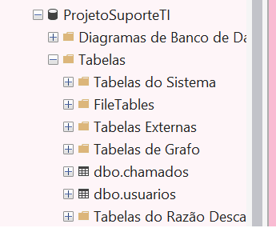
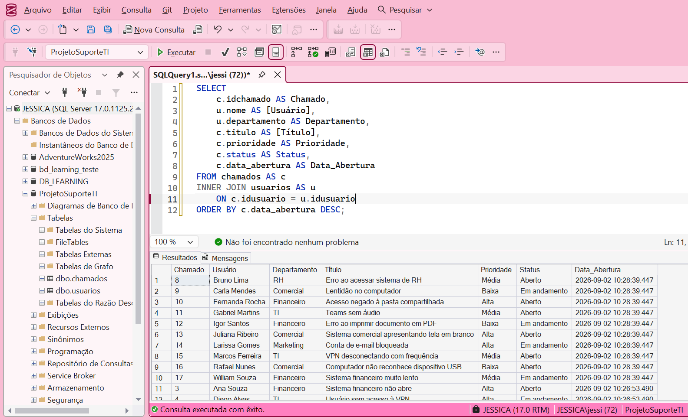
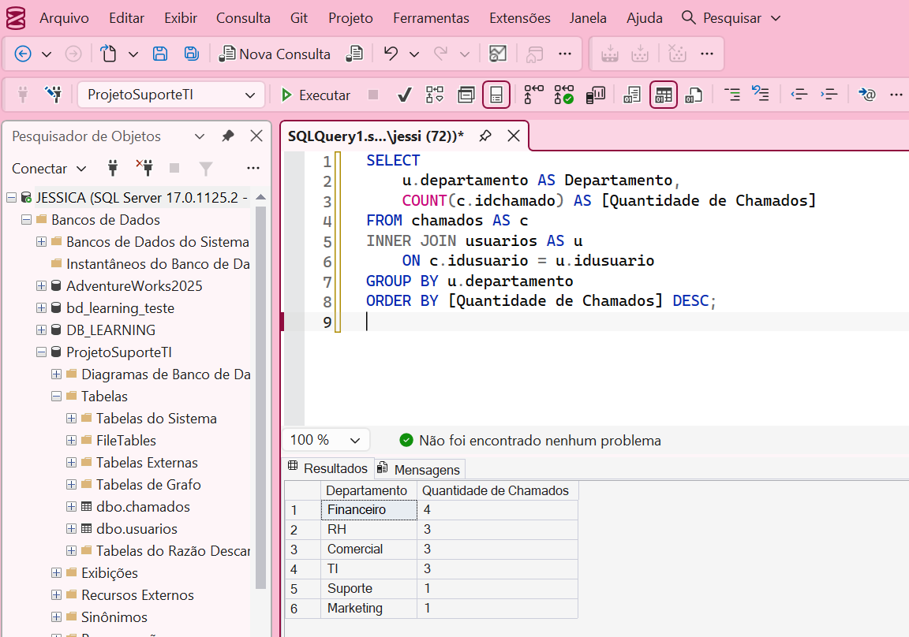
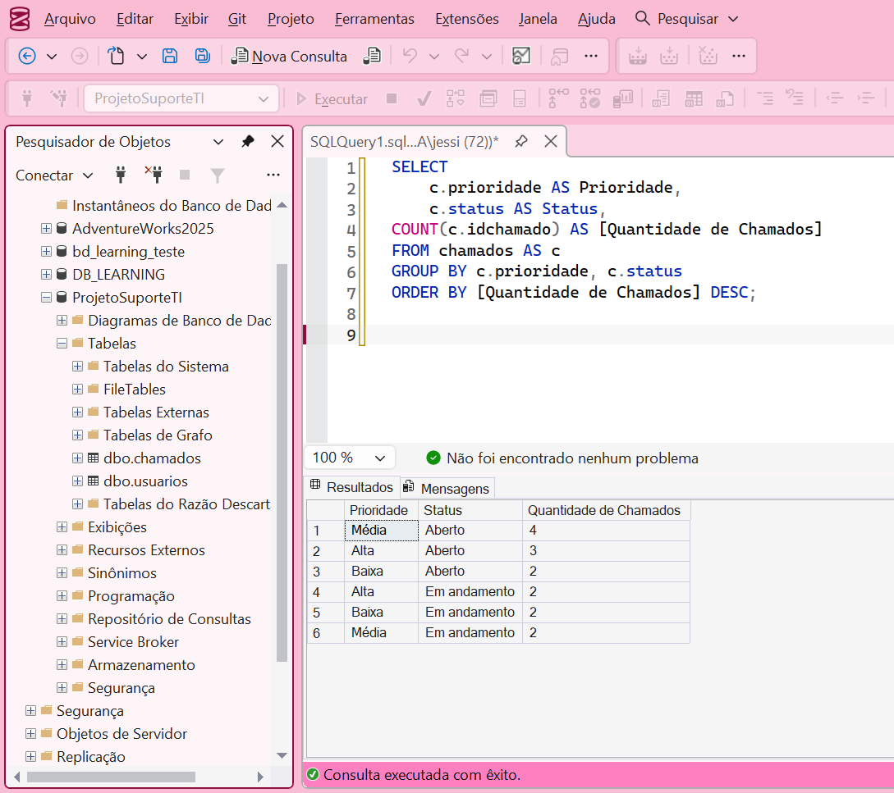
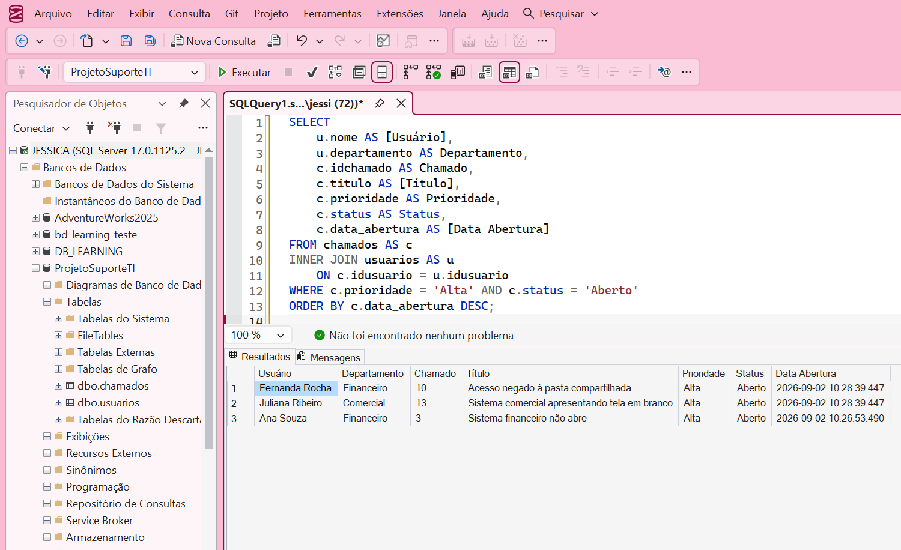
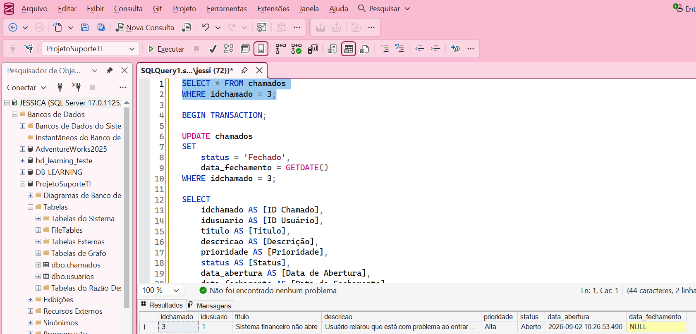
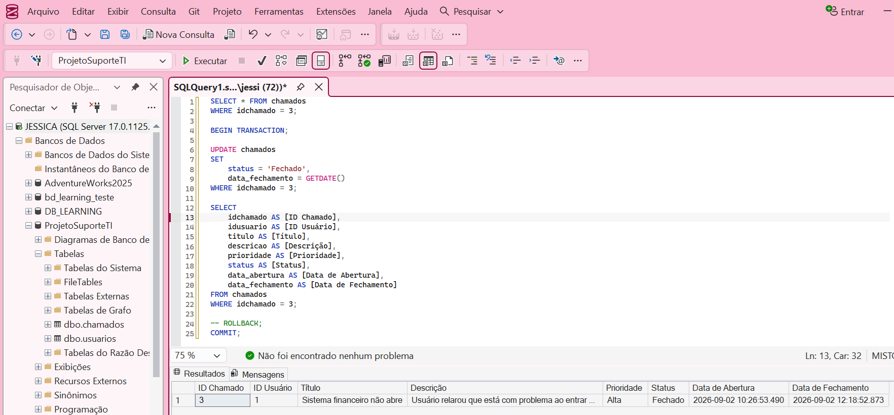

# Projeto Suporte TI - SQL Server

Projeto prático desenvolvido em **Microsoft SQL Server** com o objetivo de simular uma base de dados utilizada por uma equipe de **Suporte Técnico** para registro e acompanhamento de chamados.

## 🎯 Objetivo

Praticar conceitos de SQL aplicados a um cenário próximo da rotina de suporte técnico, trabalhando com usuários, chamados, prioridades, status e departamentos.

## 🛠️ Tecnologias utilizadas

- Microsoft SQL Server
- SQL Server Management Studio (SSMS)
- T-SQL

## 🗃️ Estrutura do banco

O banco de dados `ProjetoSuporteTI` possui duas tabelas principais:

### Usuarios

Armazena informações dos usuários que podem abrir chamados:

- ID do usuário
- Nome
- E-mail
- Departamento
- Status ativo/inativo

### Chamados

Armazena os chamados registrados pelos usuários:

- ID do chamado
- Usuário
- Título
- Descrição
- Prioridade
- Status
- Data de abertura
- Data de fechamento

As tabelas são relacionadas através de uma **Foreign Key** entre `Chamados.idusuario` e `Usuarios.idusuario`.

## 📚 Conceitos praticados

- CREATE DATABASE
- CREATE TABLE
- PRIMARY KEY
- FOREIGN KEY
- IDENTITY
- NOT NULL
- DEFAULT
- INSERT INTO
- SELECT
- WHERE
- ORDER BY
- INNER JOIN
- COUNT()
- GROUP BY
- UPDATE
- GETDATE()
- BEGIN TRANSACTION
- COMMIT
- ROLLBACK

## 🔎 Consultas realizadas

Durante o projeto foram desenvolvidas consultas para:

- relacionar chamados aos usuários e departamentos;
- identificar chamados por prioridade e status;
- calcular a quantidade de chamados por departamento;
- calcular a quantidade de chamados por prioridade e status;
- localizar chamados de prioridade alta ainda em aberto;
- atualizar o status e a data de fechamento de um chamado utilizando transação.

## 📸 Demonstração

### 1. Estrutura do banco de dados

Banco `ProjetoSuporteTI` com as tabelas `usuarios` e `chamados`.

### 2. Relacionamento entre chamados e usuários

Consulta utilizando `INNER JOIN` para relacionar os chamados aos usuários e seus respectivos departamentos.

### 3. Quantidade de chamados por departamento

Consulta utilizando `COUNT()`, `GROUP BY` e `ORDER BY` para identificar a quantidade de chamados registrada por departamento.

### 4. Chamados por prioridade e status

Agrupamento dos chamados por prioridade e status para facilitar a análise da fila de atendimento.

### 5. Chamados de alta prioridade em aberto

Consulta utilizando filtros com `WHERE` e `AND`, juntamente com `INNER JOIN`, para localizar chamados de prioridade alta que permanecem em aberto.

### 6. Atualização de chamado com transação

Antes da atualização, o chamado encontra-se com status `Aberto` e sem data de fechamento.

Após o `UPDATE`, o chamado passa para o status `Fechado` e recebe a data de fechamento. A alteração é confirmada utilizando `COMMIT`.

## 💡 Aprendizados

O projeto permitiu revisar e aplicar conceitos de SQL em um cenário prático de suporte técnico, desde a criação e relacionamento das tabelas até consultas analíticas e atualização segura de registros utilizando transações.
